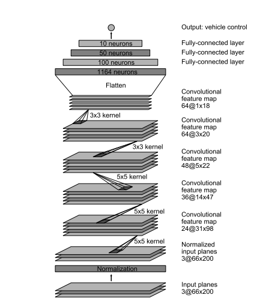

## Udacity Self Driving Car Nanodegree Project 3 - Behavioral Cloning

### Network Architechture

For this project, I was able to create a neural network that can steer a car with constant throttle in a simulated environment. I implemented the [Nvidia Paper on End-to-end learning for Self-Driving Cars](https://arxiv.org/pdf/1604.07316v1.pdf) for my neural architechture which has demonstrated the ability to steer a car in the real world. The model takes in as an input 66x200X3 images. The model consists of 24 filters followed by 36 filters, 48 filters and two 64 filter segments. Each segment has 2x2 max pooling, a dropout layer, and a relu activation function. The final segment flattens the input data then consists of fully several fully conneted layers (dense layer of 1164 neurons, a dropout layer, dense layer of 100, dense layer of 50, dense layer of 10, and finally a dense layer of 1 to generate the output). It is important to note that it is not possible to distinguish which parts of the network do feature extraction and which parts of the network providing the steering prediction.

NVIDIA ConvNet Architechture for Steering Angle Prediction:  

### Training
An Ubuntu 16.04 machine with an Intel i5 processor and a Nvidia GTX 1070 GPU was used to train the network. Before the network could be trained, the images had to be preprocessed. The training images were resized, normalized, and transformed to YUV from RGB. In addition brightness, shadows were added at random to images. Images were also flipped at random. Lastly, the center, left, or right image was chosen at random for each image in the training set. The purpose of these functions was to augment the data and thus provide the neural network with robust training examples to help it generalize. The functions were provided by [Vivek Yadev's post on data augmentation](https://chatbotslife.com/using-augmentation-to-mimic-human-driving-496b569760a9#.hlx538tr0). The batch size for training was 64 and there were 16 epochs in total. After every 2 epochs, the steering angle size for each image in the training set was increased until the last training set of images were for mostly steering angles of above the absolute value of 0.10. This was to ensure that the large steering angles were well represented in the training and not diluted by the many more training examples of when the steering angle was around zero i.e. the car was driving straight.

For a validation set, 10% of the data was held out. This data was preprocessed with resizing, normalizing and transforming just like in training. However, none of the data augmentation was performed. It is interesting to note that the validation error was slightly less than the the training error. This could be because of the lack of data augmentation in the validation set as well as the dropout layers used to reduce overfitting in the network architechture. Lastly, the Adam optimizer was used for training with a learning rate of 1e-4. 

### Results

The model was able to successfully predict the steering angles needed to drive the car sucessfully around the first track. However, the model did not generalize well enough to drive on the second track. 
 
The original implementation of the model was able to successfully steer the car straight, but was not able to make tight turns. This was fixed by training the model with mostly large steering angles in the last several epochs. 

It is interesting to note that the car is capable of recoving from steering mistakes on the first test track all though these examples were never recorded and part of the data. This is a result of the data augmentation techniques that were used.

### Conclusion

The neural network was capable of demonstrating sucessful driving on the test track it was trained on. However, when introduced to a new test track it was not able to perform successful driving. Future work is needed to train the model in a sufficient manner to allow proper driving in other environments. In future work, I will look to make sure the model is not overfit to the training data and that the preprocessing of the images is done in a correct manner.

